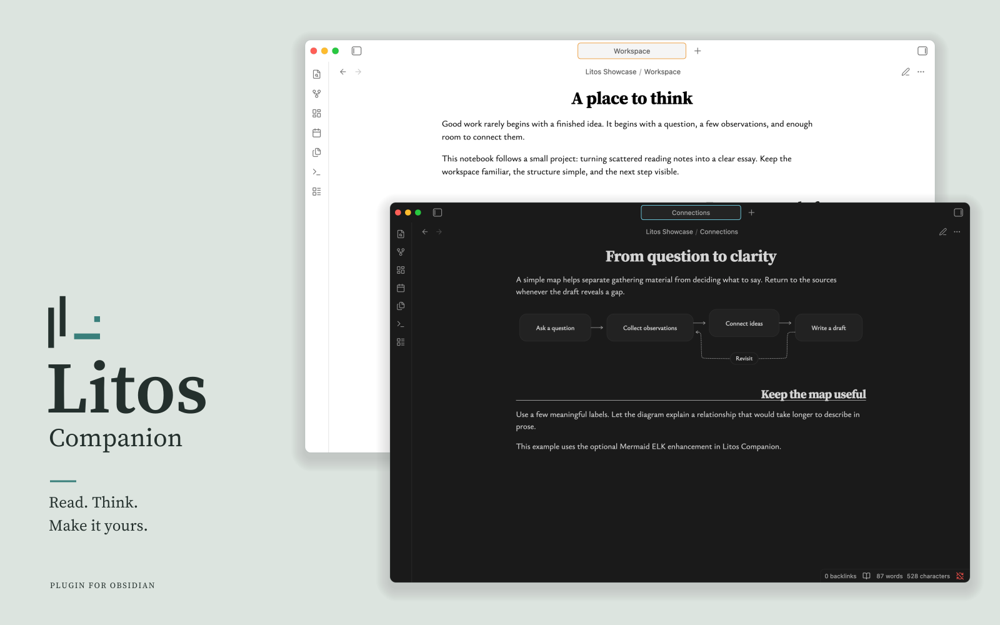

Make the [Litos](https://github.com/zerokei/Litos) workspace your own with optional display controls and Mermaid ELK support.

Litos provides the theme; Litos Companion adds controls and diagram capabilities. Install either independently. Heading controls require a compatible Litos theme.

## Features

- **Zen mode**: Hide workspace controls for a quieter view; toggle from settings or the command palette.
- **Heading controls**: Adjust H2 alignment in Reading view and Live Preview.
- **Accent color**: Adjust Obsidian’s native accent color from the plugin settings.
- **Mermaid ELK support**: Use ELK automatic layout for Mermaid flowcharts.

## Requirements

- Obsidian **1.13.7 or later** on desktop.
- Heading controls require a Litos theme version that supports **Companion API 1**.
- Mermaid ELK support also works with other themes. It is disabled by default and can be enabled in the plugin settings.

Download from [GitHub Releases](https://github.com/Zerokei/Litos-Companion/releases). See the [user guide](docs/usage.md) for installation and usage instructions.

## Dependencies

| Dependency | Version | Purpose |
| --- | --- | --- |
| Mermaid | 11.16.1 | Diagram parsing and rendering |
| @mermaid-js/layout-elk | 0.2.0 | ELK layout integration |
| yaml | ^2.9.1 | Diagram configuration parsing |

Built with TypeScript, esbuild, and Vitest. See [package.json](package.json) for the complete dependency list.

## Documentation

- [User guide](docs/usage.md)
- [Development guide](docs/development.md)
- [Architecture and theme API](docs/architecture.md)
- [Examples](examples/验收示例.md) and [validation report](docs/validation.md)

## License

[MIT](LICENSE). Third-party components are distributed under their respective licenses; see [third-party notices](docs/third-party-notices.txt).
