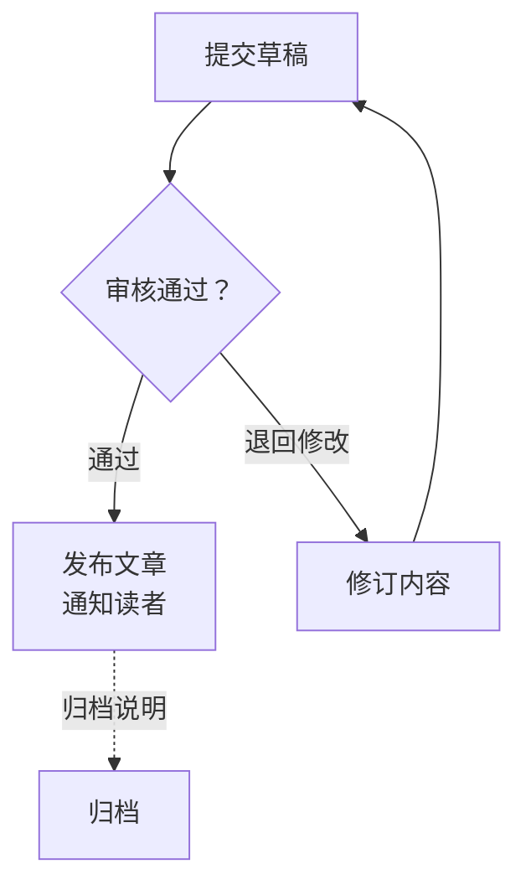
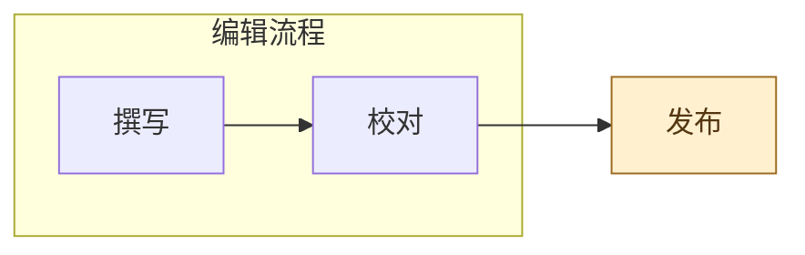
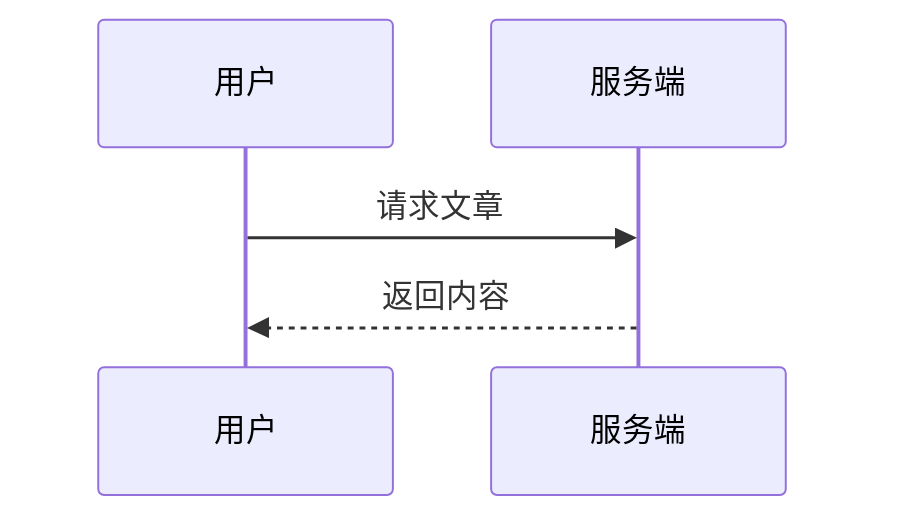
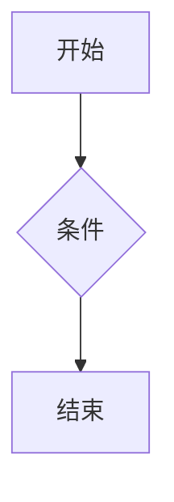

# Litos Companion 验收

## 二级标题：默认靠右，可切换靠左

这一段用于检查阅读模式与实时预览的一致性。

## 流程图：分支、循环与多行标签

```mermaid
flowchart TD
    A[提交草稿] --> B{审核通过？}
    B -->|通过| C["发布文章<br/>通知读者"]
    B -->|退回修改| D[修订内容]
    D --> A
    C -.归档说明.-> E[归档]
```

## 子图与显式颜色

```mermaid
flowchart LR
    subgraph Writing[编辑流程]
        A[撰写] --> B[校对]
    end
    B --> C[发布]
    classDef highlighted fill:#fff0d0,stroke:#9c6b20,color:#533610
    class C highlighted
```

## 时序图：继续使用 Obsidian 内置渲染

```mermaid
sequenceDiagram
    用户->>服务端: 请求文章
    服务端-->>用户: 返回内容
```

## 显式 Dagre：保留原布局

```mermaid
---
config:
  layout: dagre
---
flowchart TD
    A[开始] --> B{条件}
    B --> C[结束]
```
